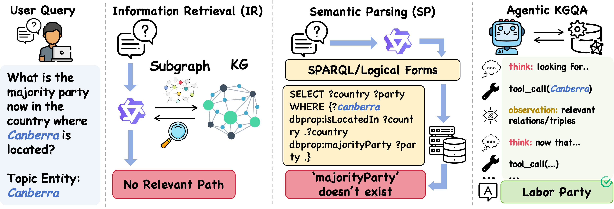
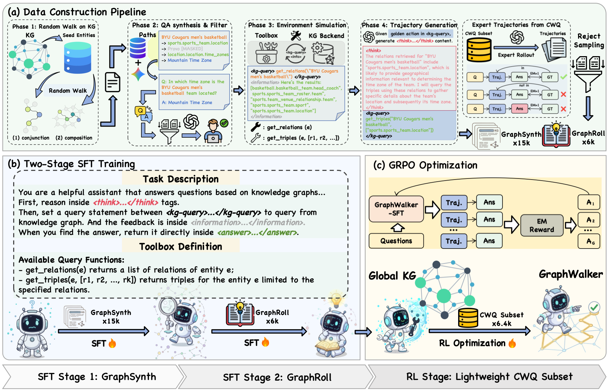

<div align="center">

### 🌐 *GraphWalker: Agentic Knowledge Graph Question Answering via Synthetic Trajectory Curriculum*

<p align="center">
  <a href="https://arxiv.org/abs/2603.28533">
    
  </a>
  &nbsp;
  <a href="https://huggingface.co/xushuwen23/GraphWalker-7B">
    
  </a>
</p>

<p align="center">
  <b>GraphWalker</b> transforms LLMs into autonomous KG reasoning agents, navigating massive knowledge graphs through a <i>Think-Query-Observe</i> loop — optimized via a three-stage synthetic curriculum.
</p>

</div>

---

## 📢 News

| Date | Update |
|------|--------|
| 🚀 **2026.03** | GraphWalker achieves **SOTA** on **CWQ (79.6 EM)** and **WebQSP (91.5 EM)** among all agentic KGQA methods |
| 🔗 **2026.03** | Integrated RL training with the **[Slime](https://github.com/THUDM/slime)** framework and SFT with **[LLaMA-Factory](https://github.com/hiyouga/LLaMA-Factory)** |

---

## 📑 Table of Contents

- [🧭 Core Concept](#-the-core-concept)
- [✨ Key Innovations](#-key-innovations)
- [🔭 System Pipeline](#-system-pipeline)
- [📊 Experimental Results](#-main-experimental-results)
- [🛠️ Installation & Setup](#️-installation--setup)
- [🚀 Quick Start](#-quick-start)
- [📦 Data Formats](#-data-formats)
- [📄 Citation](#-citation)

---

## 🧭 The Core Concept

GraphWalker tackles the twin bottlenecks of **data scarcity** and **reasoning generalization** in KGQA through a structured **Three-Stage Curriculum**:




---

## ✨ Key Innovations

### 1 · Synthetic Trajectory Synthesis

| Component | Role |
|-----------|------|
| **GraphSynth** | Covers complex topological structures — *Composition*, *Conjunction* — to teach structured graph navigation |
| **GraphRoll** | Equips the agent with self-correction and backtracking, conditioned on live environment feedback |

### 2 · Agentic KG Interaction Loop

At each turn $t$, the agent emits a fully structured response:

```
┌──────────────────┬──────────────────────────────────────────────────┐
│  <think>         │  Internal reasoning & strategy planning          │
│  <kg-query>      │  Precise tool calls: get_relations, get_triples  │
│  <information>   │  Real-time feedback from the Virtuoso KG server  │
│  <answer>        │  Final grounded prediction                       │
└──────────────────┴──────────────────────────────────────────────────┘
```

---

## 🔭 System Pipeline



> *Full Pipeline: Data Construction → Two-Stage SFT → RL Optimization*

---

## 📊 Main Experimental Results

GraphWalker achieves **SOTA** across all agentic KGQA methods. **Bold** = best, <u>underline</u> = second-best.

<table>
<thead>
<tr>
<th align="left">Method</th>
<th align="left">Backbone</th>
<th align="center">CWQ EM</th>
<th align="center">CWQ F1</th>
<th align="center">WebQSP EM</th>
<th align="center">WebQSP F1</th>
</tr>
</thead>
<tbody>
<tr><td colspan="6"><i>🔹 Vanilla LLMs (IO Prompt)</i></td></tr>
<tr>
<td>IO Prompt</td><td>Qwen2.5-3B-Instruct</td>
<td align="center">22.0</td><td align="center">17.7</td><td align="center">44.6</td><td align="center">30.3</td>
</tr>
<tr>
<td>IO Prompt</td><td>Qwen2.5-7B-Instruct</td>
<td align="center">25.7</td><td align="center">20.7</td><td align="center">50.9</td><td align="center">33.2</td>
</tr>
<tr>
<td>IO Prompt</td><td>GPT-4o-mini</td>
<td align="center">45.5</td><td align="center">33.6</td><td align="center">47.1</td><td align="center">39.3</td>
</tr>
<tr>
<td>IO Prompt</td><td>DeepSeek-V3.2</td>
<td align="center">50.1</td><td align="center">43.5</td><td align="center">63.8</td><td align="center">55.7</td>
</tr>
<tr><td colspan="6"><i>🔹 Agentic KGQA Methods</i></td></tr>
<tr>
<td>RoG</td><td>LLaMA-2-7B-Instruct</td>
<td align="center">62.6</td><td align="center">56.2</td><td align="center">85.7</td><td align="center">70.8</td>
</tr>
<tr>
<td>ToG</td><td>GPT-4</td>
<td align="center">69.5</td><td align="center">—</td><td align="center">81.9</td><td align="center">—</td>
</tr>
<tr>
<td>ToG-2.0</td><td>GPT-3.5</td>
<td align="center">68.9</td><td align="center">65.8</td><td align="center">77.8</td><td align="center">74.5</td>
</tr>
<tr>
<td>GoG</td><td>GPT-4</td>
<td align="center">75.2</td><td align="center">—</td><td align="center">84.4</td><td align="center">—</td>
</tr>
<tr>
<td>KBQA-o1</td><td>LLaMA3.1-8B-Instruct</td>
<td align="center">—</td><td align="center">—</td><td align="center">75.8</td><td align="center">82.1</td>
</tr>
<tr>
<td>KG-Agent</td><td>LLaMA2-7B-Instruct</td>
<td align="center">72.2</td><td align="center"><u>69.8</u></td><td align="center">83.3</td><td align="center">81.0</td>
</tr>
<tr>
<td>†KG-R1</td><td>Qwen2.5-3B-Instruct</td>
<td align="center">66.8</td><td align="center">61.7</td><td align="center">82.1</td><td align="center">78.9</td>
</tr>
<tr><td colspan="6"><i>🔸 GraphWalker (Our Method)</i></td></tr>
<tr>
<td>†Vanilla Agent</td><td>Qwen2.5-7B-Instruct</td>
<td align="center">40.7</td><td align="center">33.2</td><td align="center">68.4</td><td align="center">66.1</td>
</tr>
<tr>
<td>†Vanilla Agent</td><td>GPT-4o-mini</td>
<td align="center">63.4</td><td align="center">60.3</td><td align="center">79.6</td><td align="center">70.6</td>
</tr>
<tr>
<td>†Vanilla Agent</td><td>DeepSeek-V3.2</td>
<td align="center">69.8</td><td align="center">63.5</td><td align="center">76.7</td><td align="center">71.8</td>
</tr>
<tr>
<td>GraphWalker-7B-SFT</td><td>Qwen2.5-7B-Instruct</td>
<td align="center">68.3</td><td align="center">63.2</td><td align="center">82.0</td><td align="center">79.1</td>
</tr>
<tr>
<td>GraphWalker-3B-SFT-RL</td><td>Qwen2.5-3B-Instruct</td>
<td align="center">70.9</td><td align="center">65.2</td><td align="center">83.5</td><td align="center">81.7</td>
</tr>
<tr>
<td>GraphWalker-8B-SFT-RL</td><td>LLaMA3.1-8B-Instruct</td>
<td align="center"><u>78.5</u></td><td align="center">69.6</td><td align="center"><u>88.2</u></td><td align="center"><u>84.5</u></td>
</tr>
<tr>
<td><b>GraphWalker-7B-SFT-RL</b></td><td><b>Qwen2.5-7B-Instruct</b></td>
<td align="center"><b>79.6</b></td><td align="center"><b>74.2</b></td><td align="center"><b>91.5</b></td><td align="center"><b>88.6</b></td>
</tr>
</tbody>
</table>

> *† denotes models evaluated under our framework with full global KG access.*

---

## 🛠️ Installation & Setup

### 1 · Environment

```bash
git clone https://github.com/GraphWalker/GraphWalker.git
cd GraphWalker
conda create -n graphwalker python=3.9 -y
conda activate graphwalker
pip install -r requirements.txt
```

### 2 · Virtuoso KG Server

Follow [`virtuoso-opensource/README.md`](virtuoso-opensource/README.md) to load Freebase and verify your `SPARQL_ENDPOINT` is accessible before running any evaluation.

---

## 🚀 Quick Start

### 1 · Evaluation (vLLM)

```bash
vllm serve "/path/to/GraphWalker-7B" \
    --host 0.0.0.0 --port 22240 \
    --served-model-name graphwalker-7b \
    --gpu-memory-utilization 0.9 --dtype auto \
    --chat-template "/path/to/chat_template.jinja"
```

```bash
bash run_eval_remote_vllm.sh
```

> 💡 Download the pretrained model from [🤗 HuggingFace](https://huggingface.co/xushuwen23/GraphWalker-7B)

### 2 · Data Generation

```bash
# Step 1 — Random walk path generation
python kgqa_agent/scripts/random_walk.py \
    --config kgqa_agent/configs/random_walk/3-5hop/random_walk_10k.yaml

# Step 2 — QA / Info synthesis / Trajectory generation
bash pipeline_scripts/qa_gen.sh
bash pipeline_scripts/info_syn.sh
bash pipeline_scripts/traj_gen.sh
```

### 3 · Training

**SFT** — Use [LLaMA-Factory](https://github.com/hiyouga/LlamaFactory) for stage-wise fine-tuning.

**RL (GRPO)** — Run via the [Slime](https://github.com/THUDM/slime) framework:

```bash
cd slime/examples/graphwalker
bash examples/graphwalker/run_qwen2.5_7B_sft.sh
```

---

## 📦 Data Formats

### Trajectory Format

```json
{
  "raw_question": "What state was Barack Obama born in?",
  "steps": [
    {
      "step_index": 0,
      "think": "I need to find where Barack Obama was born...",
      "action": "get_relations(\"Barack Obama\")",
      "information": ["people.person.place_of_birth", "..."]
    }
  ]
}
```

---

## 📄 Citation

If you find GraphWalker useful in your research, please consider citing:

```bibtex
@misc{xu2026graphwalkeragenticknowledgegraph,
      title={GraphWalker: Agentic Knowledge Graph Question Answering via Synthetic Trajectory Curriculum}, 
      author={Shuwen Xu and Yao Xu and Jiaxiang Liu and Chenhao Yuan and Wenshuo Peng and Jun Zhao and Kang Liu},
      year={2026},
      eprint={2603.28533},
      archivePrefix={arXiv},
      primaryClass={cs.CL},
      url={https://arxiv.org/abs/2603.28533}, 
}
```

> 📖 Preprint available on [arXiv:2603.28533](https://arxiv.org/abs/2603.28533)

---

<div align="center">
  <sub>
    Made with ❤️ &nbsp;·&nbsp;
    <a href="https://arxiv.org/abs/2603.28533">Paper</a> &nbsp;·&nbsp;
    <a href="https://huggingface.co/xushuwen23/GraphWalker-7B">Model</a>
  </sub>
</div>
